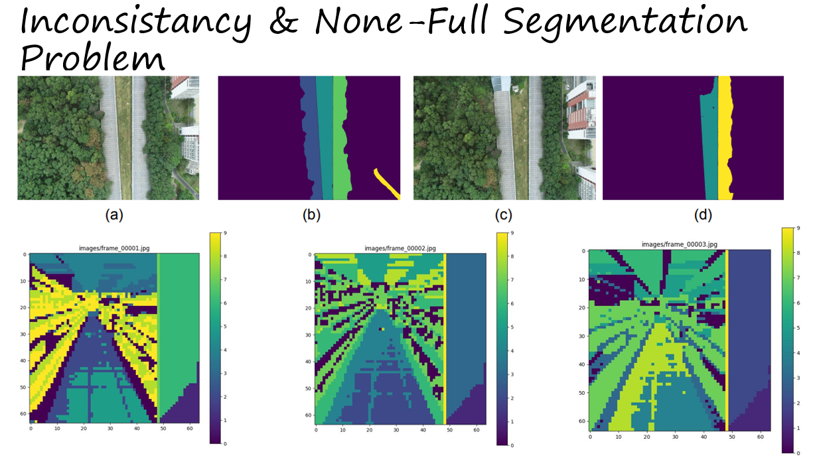
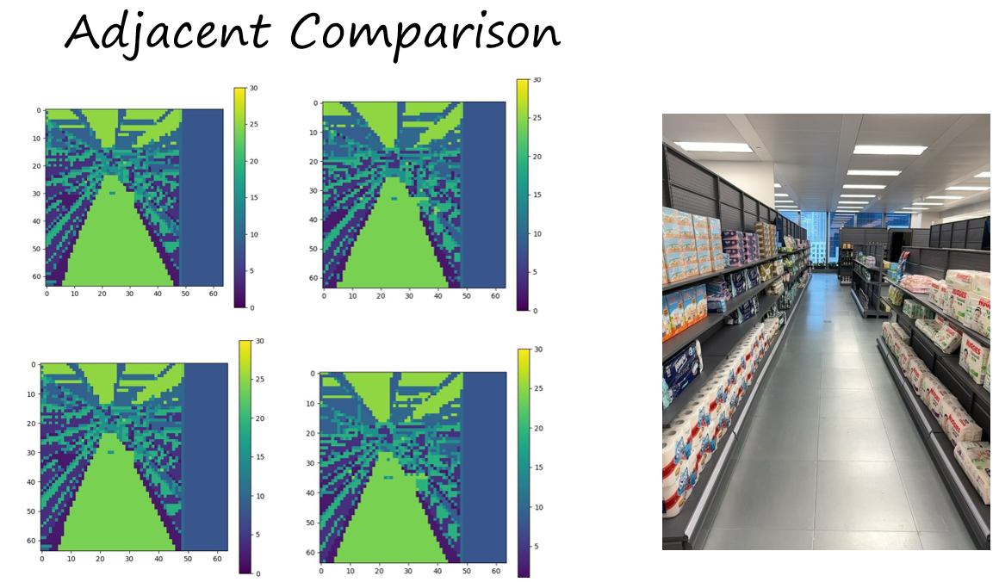
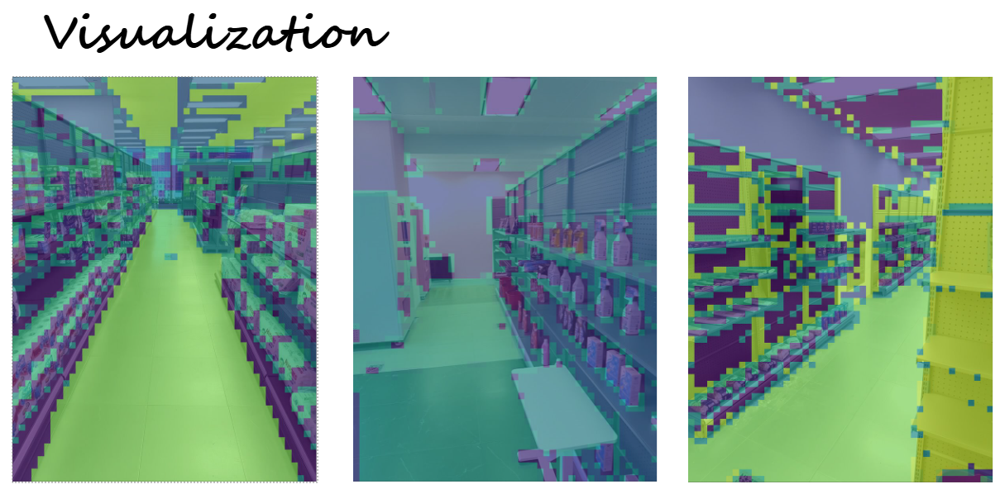

# Semantic Consistanct Latent Sam 

- We utilize Hierachical Clustering Method to alleviate inconsistancy problem
- We provide a coarse to fine stratgy to refine the rough mask result we have (64*64)
- We achieve a better result only on quntization

## Problem Definition
- Inconsistancy


## Result for Rough Result

 to install othere related package

Download a image dataset 
```
--Image_Folder
    |- image1
       image2
       image4
        ...
```
## Use Code

Change the following code in run.sh:
```
CUDA_VISIBLE_DEVICES=x python -W ignore clustering_features.py \
    --sam_checkpoint 'sam model path' \ # need to be changed
    --image_dir 'image dir ' \ # need to be changed
    --batch_num 4 \
    --output_dir debugging \
    --debugging True \
    --device cuda 
```

## Visualization 
To visualize our result, one can run the following code in run.sh

```
python visualization.py \
    -i /data/grocery_store/10F/input/ \ # Input image 
    -m output/saved_labels.npz \ # Mask File
    -o output/ # Output folder
```

