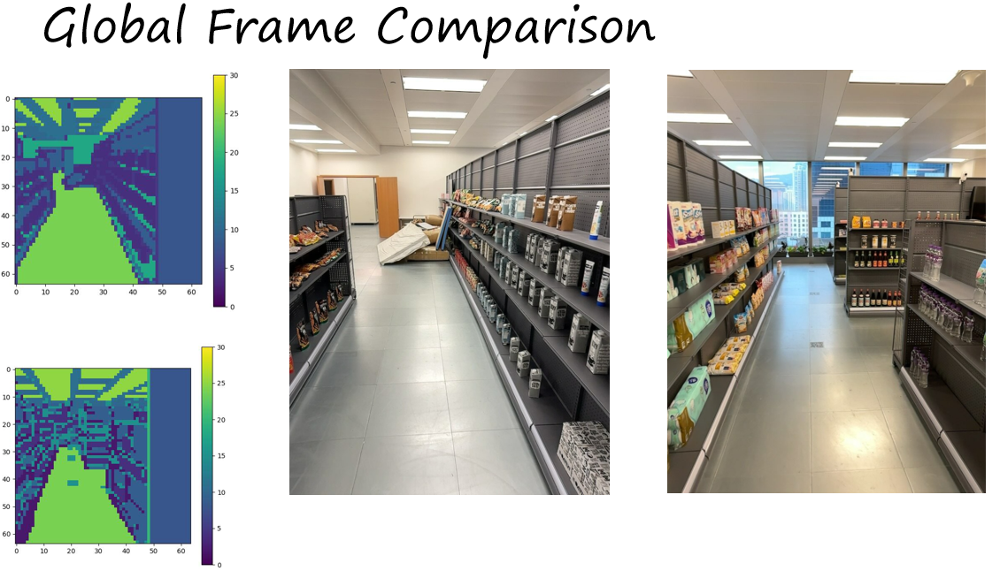

# Semantic Consistanct Latent Sam 

- We utilize Hierachical Clustering Method to alleviate inconsistancy problem
- We achieve a better result only on quntization

## Problem Definition
- Inconsistancy


## Result




## Install
After clone 
```
    conda create -n sc-latent-sam python=3.9 -y
    conda install -c  https://mirrors.tuna.tsinghua.edu.cn/anaconda/cloud/rapidsai/ cuml # if u r in China Mainland
    conda install rapidsai::cuml # if you are in a place where there is no saction and firewalls
```

Follow  [SAM](https://github.com/facebookresearch/segment-anything) to install othere related package

Download a image dataset 
```
--Image_Folder
    |- image1
       image2
       image4
        ...
```
## Use Code

Change the following code in run.sh:
```
CUDA_VISIBLE_DEVICES=x python -W ignore clustering_features.py \
    --sam_checkpoint 'sam model path' \ # need to be changed
    --image_dir 'image dir ' \ # need to be changed
    --batch_num 4 \
    --output_dir debugging \
    --debugging True \
    --device cuda 
```
